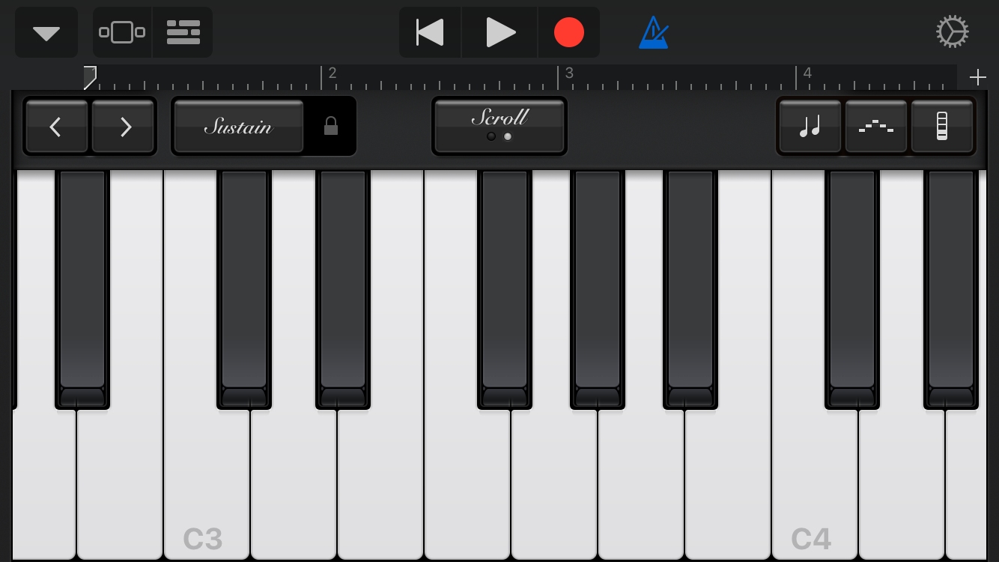
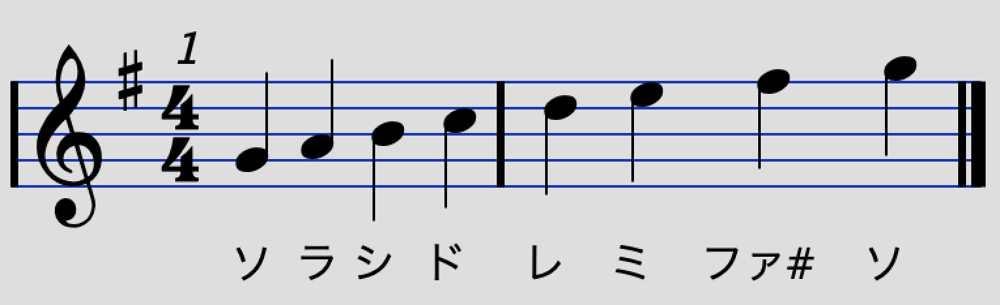
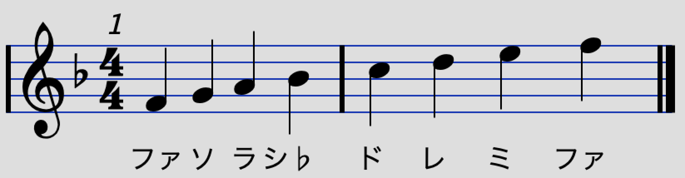
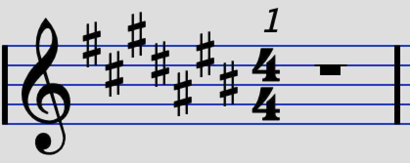

# コード入門 1-2
YNUCL COMICAL COMIC△7  
 
### 目次
1. 序文
2. 基礎知識	
	1. 平均律
	1. スケール
	2. 音程
	2. 調号
2. コード 
	1. 和音
	2. メジャーとマイナー
	2. トライアドコード
	3. テトラッドコード
	4. 分数コード
	5. テンション
3. コード進行
	1. 三大進行
	2. トニック、ドミナント、サブドミナント
	3. ドミナントモーション
	4. ツーファイブ

## 序文
　現代音楽におけるコードの役割は計り知れないほど大きく、コードをある程度理解するだけで実際に曲を作ることが出来るようになるといっても過言ではありません。このテキストではまず基本的な用語と知識を用意し、いくつかの主要なコードを使用例とともに紹介し、それらを用いたコード進行を考えます。
 
## 基礎知識
### 平均律と調号
　まず、ピアノの鍵盤を見てみましょう。
 

C3 と書いてある鍵盤から C4 と書いてある鍵盤（の一つ前まで）の間に、白色の鍵盤（**白鍵**）と黒色の鍵盤（**黒鍵**）が12個並んでいます。高校の物理などで聞いたことがあるかと思いますが、音とはつまり物理現象で言うところの**空気の波**であり、音の高さは**波の周波数**によって決まります。C3という鍵盤を押すと約130Hzの音が、同様にC4という鍵盤を押すと約260Hzの音が鳴ります。  
　より正確に、55Hzの音を「A1」と定義し、倍の110Hzの音をA2、さらにその倍の220Hzの音をA3などと定義し、その間に比が等しくなるように12個に分けて行けて、下のように名前をつけていきます。ちなみにこの等比数列の公比は $\sqrt[12]{2}$ です。
 
周波数|110|116|123|130|138|146|155|164|174|184|195|207|220
---|---|---|---|---|---|---|---|---|---|---|---|---|---
音名|A2|A#2|B2|C3|C#3|D3|D#3|E3|F3|F#3|G3|G#3|A3

これを上から下まで並べていったものを **十二平均律** といいます。現代の音楽はほぼ100%この十二平均律が用いられています。この列の中で隣同士に並んだ音のことを**半音**の関係、1つ飛ばして並んだ音のことを**全音**の関係といいます。さらに12個飛ばして並んだ音のことを**オクターブ**の関係といいます。  
　なお、音名にアルファベットを用いましたが、これは英語を用いた音名であり、一般的にはイタリア語およびドイツ語を用いた音名が使われていますが、後述する調合には日本語を用いることもあります。

英語|C|D|E|F|G|A|B
:-:|:-:|:-:|:-:|:-:|:-:|:-:|:-:
伊語|ド|レ|ミ|ファ|ソ|ラ|シ
独語|ツェー|デー|エー|エフ|ゲー|アー|ベー
日本語|ハ|ニ|ホ|ヘ|ト|イ|ロ

　さらに、音名に「#」（シャープ）がつくと**半音高い音**を表します。同様に音名に「♭」（フラット）がつくと**半音低い音**を表します。なお、シャープが2つ付く場合は半音2つ分、つまり全音高い音になります。  
　例えば、E#は上記の表を見ると一つ右隣の音になるのでFということになります。さらに、C♭はBということになります。  
　英語やイタリア語は半音の高い低いを#と♭で表しますが、日本語では半音高いを「**嬰（えい）**」、半音低いを「**変（へん）**」で表します。例えばF#なら「嬰ヘ」、E♭なら「変ホ」などと言います。ドイツ語は難しいので割愛します。*お兄さん許して...*

### スケール
　さて、もう一度ピアノに戻ります。ピアノの白鍵だけをドから順に弾いてみると、

音名|ド|レ|ミ|ファ|ソ|ラ|シ|ド
:-:|:-:|:-:|:-:|:-:|:-:|:-:|:-:|:-:
関係|-|全|全|半|全|全|全|半

となっていることが分かります。難しいことは置いておいて、この白鍵だけの音階を**ダイアトニックスケール**といいます。正確にはCメジャー・(ダイアトニック)スケールといいますが、これはCつまりドの音から始まっていることを意味しているとだけ考えて頂いて構いません。メジャースケールはなんか明るい感じの音階という理解で問題ありません。

音名|ド|レ|ミ♭|ファ|ソ|ラ♭|シ♭|ド 
:-:|:-:|:-:|:-:|:-:|:-:|:-:|:-:|:-:  
関係|-|全|半|全|全|半|全|全 

また、上記のように黒鍵を交えて弾いてみると、*なんか暗い感じ*の音階になります。これをCマイナー・スケールといいます。なお、このテキストではスケールについての詳しい話はこれ以上はしません。  

### 音程
　和音とは2つ以上の音からなる旋律のことです。一般的には3つ以上の音からなる和音を**コード**といい、それぞれに名前がついています。コードについては後で考えるとして、ここでは2つの音からなる音程について考えます。

### 調号
　先程のメジャースケールでも述べましたが、何の音から始まるかでCメジャーだとかGメジャーだとかに名前が変わります。
 
もしGつまりソの音から始まるメジャースケールの場合、

音名|ソ|ラ|シ|ド|レ|ミ|ファ#|ソ  
:-:|:-:|:-:|:-:|:-:|:-:|:-:|:-:|:-:  
関係|-|全|全|半|全|全|全|半  

となります。7個目の音に注目すると「ファ」に#がついています。

さらにFつまりファの音から始まるメジャースケールの場合、

音名|ファ|ソ|ラ|シ♭|ド|レ|ミ|ファ
:-:|:-:|:-:|:-:|:-:|:-:|:-:|:-:|:-: 
関係|-|全|全|半|全|全|全|半

となり、「シ」に♭がついています。

このように、何の音から始まるかによって、何かの音にシャープやフラットがつくことがあります。今はメジャー・スケールについて考えているので、これらを**長調**といいます。一般的に長調（や短調）は日本語で表します。1つ目の例ではソつまりトの音から始まっているので「ト長調」、2つ目の例ではファつまりヘの音から始まっているので「ハ長調」といいます。

ト長調

ヘ長調

ピアノ譜ではスケールを明示するために、#や♭は左側に固めて書いておきます。つまり、この部分さえ見れば「**この曲は何調か？**」ということが分かります。例えば、

だと嬰ハ長調、つまりド#から始まる音階です。シャープやフラットの数と楽曲の調を把握するのは覚えゲーです。でも、**覚えておいたほうが絶対に良いです。**  
　覚え方はいろいろあるのですが、形式的にはシャープやフラットがついていく音を順番に覚えていくのが良いです。  

#### シャープの場合

数|音|調
---|---|---
0|-|ハ長調
1|ファ|ト長調
2|ファド|ニ長調
3|ファドソ|イ長調
4|ファドソレ|ホ長調
5|ファドソレラ|ロ長調
6|ファドソレラミ|嬰へ長調
7|ファドソレラミシ|嬰ハ長調

#### フラットの場合

数|音|調
---|---|---
0|-|ハ長調
1|シ|ヘ長調
2|シミ|変ロ長調
3|シミラ|変ホ長調
4|シミラレ|変イ長調
5|シミラレソ|変ニ長調
6|シミラレソド|変ト長調
7|シミラレソドファ|変ハ長調

シャープの場合、「ファドソレラミシ」の順についていきます。これはファから数えて
