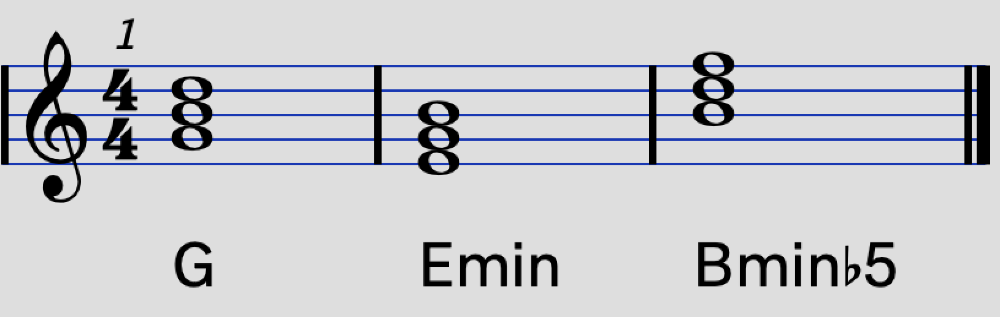

# コード入門 3
YNUCL COMICAL COMIC△7

## コード進行

　さて、前章までで様々なコードを見ていきました。この章ではそれらのコードを組み合わせてコード進行というものを構成し、実際にメロディに対する伴奏を作ることを考えていきます。コード進行をある程度理解できれば作曲はマスターしたと言っても過言ではありません。*過言過言ってそれしか言えんのかこの猿ゥ！*
 
### 三大進行

　ジャズやクラシックといったジャンル固有の普遍的なコード進行はもちろん沢山あるのですが、ここではポップあるいはロックミュージックに限って、それも昨今の日本における状況に限ってお話したいと思います。  
　まず、コード進行を理論的に理解する前に具体的なコード進行を3つ紹介します。順に**カノン進行、王道進行、小室進行**です。J-POPはこの3つのコード進行でほぼ網羅できるため、これらを**三大進行**と言ったり言わなかったりします。三大進行は**循環コード**のため、これを延々と続けて弾くことができるのも特徴です。なお簡単のため、この節ではCメジャースケールで考えることとします。  
　普段曲を聞いたときに、「あ、これはカノン進行だな」とか「ここは王道進行だ！」とかがすぐわかるようになると音楽の聴取における幅が広がるだけでなく、演奏や作曲での「**初手の感覚**」を掴むことが出来ると思われます。
 
#### カノン進行

	C G Am Em F C F G

と表される進行を**カノン進行**と言います。もともとこれは「パッヘルベルのカノン」という曲のコード進行であり、汎用性の高さからこのコード自体にカノンコードという名前が付けられました。  

##### 使用例

* 神絵師 / COMICAL COMIC△7
* マリーゴールド / あいみょん
* 風になる / つじあやの
* 明日への扉 / I WiSH
* チェリー / スピッツ
* Wherever you are / ONE OK ROCK
* U&I / 放課後ティータイム
* Home Street / Poppin'Party
 
#### 王道進行

	F G Em Am
    
と表される進行を**王道進行**と言います。FがDm7になったりEmがEだったり…と、様々なバリエーションがありますが、それらをひっくるめて王道進行と言うことにします。サビでもメロでもどこでも使える使い勝手の良いコード進行です。古くはユーロビートやフュージョンに使われ、そこからディスコミュージックに昇華し、バブル時代のディスコブームを経て現在のポップミュージックへと受け継がれているのがこのコード進行なのです。筆者は**王道進行マニア**ですのでもっと沢山書きたいことがありますが、泣く泣く省略します。  

##### 使用例

* 夏祭り / whiteberry
* 虹 / Aqua Timez
* 気まぐれロマンティック / いきものがかり
* 高嶺の花子さん / back number
* Don't say "Lazy" / 桜高軽音部
* DAYS / FLOW
* ぼくのフレンド / みゆはん
* B.O.F / Poppin'Party
* Legendary / Roselia

#### 小室進行

	Am F G C
    
　日本の音楽プロデューサー小室哲哉氏が多用したことからこの名前が付けられました。「**ぱっと聞き**」の感覚だと「あぁいい曲だな〜」と感じる、そんなコードだと思われます。この「ぱっと聞き」の概念を筆者は結構大切にしていたりもします。
 
##### 使用例

* Get Wild / TM Network
* MARIONETTE / BOOWY
* summer / 久石譲
* サウダージ / ポルノグラフィティ
* 残酷な天使のテーゼ / 高橋洋子
* 千本桜 / 黒うさP
* 走り始めたばかりのキミに / Poppin'Party
* Returns / Poppin'Party

### 単音の進行
　コードの組み合わせであるコード進行の理論を見る前に、一つの音がどのように移行するか、ということに絞って考えていきます。
 
#### 強進行

 ある音から4度上（5度下）の音へ移る進行を**強進行**と言います。Cメジャースケールでのソからドへ移る進行は強進行の一つです。単音の進行の中で最も2つの音の関係性が強く結ばれるような進行です。
 
#### 変進行

　ある音から4度下（5度上）の音へ移る進行を**変進行**と言います。ちょうど強進行の逆の動きになっていることがわかると思います。
 
#### 準強進行

　ある音から2度上あるいは3度下の音へ移る進行を**準強進行**と言います。

#### 全音進行

　ある音から上下に限らず全音ずつ移動する進行を**全音進行**と言います。上に行く場合は長2度の準強進行とも言えますね。
 

ダイアトニックスケールはほとんど**全音の関係性で成り立っている**ので、普通に全音進行すればほとんどは単なるメロディの範疇ですが、本来ならスケールの中で半音で移行するところを全音進行すると「ん？」というワクワク感を得ることが出来ます。ちなみに関係性が全音であるスケールを**ホールトーンスケール**と言います。

#### 半音進行

　ある音から上下に限らず半音ずつ移動する進行を**半音進行**と言います。前述の通りダイアトニックスケールの基本は全音進行なので、半音進行は何かしら意味の持った**全音進行を補助する役割が大きい**です。

### トニック・ドミナント・サブドミナント

　三大進行の節ではCメジャースケールを用いて例を紹介しました。しかしながら、**コード進行はスケールによらない**という性質があり、**どのような調を用いていたとしても統一的な手法でコードを展開することが出来ます**。この性質こそが、コード理論が曲作りにおいて最も重要な役割を担っている理由の一つなのです。そこで、この節では今一度コード進行の理論を形式的に考えてみましょう。
 
#### ディグリーネーム

　ダイアトニックスケールを一つ固定して考えます。
 
　スケールの一番はじめの音をローマ数字の「I」で表し、以降順に II, III, ..., VII と番号を付けていきます。
 
スケール | I | II | III | IV | V | VI | VII
:-: | :-: | :-: | :-: | :-: | :-: | :-: | :-:
C |ド|レ|ミ|ファ|ソ|ラ|シ
F |ファ|ソ|ラ|シ♭|ド|レ|ミ
G |ソ|ラ|シ|ド|レ|ミ|ファ#

2章で例を示したC、F、Gメジャースケールでの番号付けを表にまとめてみました。
　コードの章で紹介したように、コードの記号は根音がC（ド）だったら「C△7」などのように、音の英語記号を用いて表していましたが、スケールによらない形式的な記述方法では「**I△7**」や「**IIm7**」のように、ローマ数字を用いてコードの記号を表します。なにか具体的なスケールを用いる場合には、そのローマ数字の部分に**実際の音を代入する**ことで実際のコードを得ることが出来るというわけです。例えば、「I△7」はCメジャースケールで考える場合 I は C の音なので C△7 となります。同様にFメジャースケールではF△7になる、といった具合です。このように、ローマ数字を用いたコードの記法を**ディグリーネーム**と言います。  
　以下、ディグリーネームを用いて理論を紹介していきます。メジャーコードの場合、**音としての記号とコードとしての記号が同じ**なので、混同しないように気をつけてください。

##### ディクリーネームを用いた三大進行

	# カノン進行
	I V VIm IIIm IV I IV V
    
    # 王道進行
    IV V IIIm VIm
    
    # 小室進行
    VIm IV V I

#### ダイアトニックコード

　スケールを固定して、IからVIIまでの音と、それらの3度上と5度上からなるトライアドコードをそのスケールの**ダイアトニックコード**と言います。
 
根音|I|II|III|IV|V|VI|VII
:-:|:-:|:-:|:-:|:-:|:-:|:-:|:-:
コード|I|IIm|IIIm|IV|V|VIm|VIIm-5

　実際にCメジャースケールでは下図のようになります。
 

根音|C|D|E|F|G|A|B
:-:|:-:|:-:|:-:|:-:|:-:|:-:|:-:
コード|C|Dm|Em|F|G|Am|Bm-5

#### トニック

　ダイアトニックコードのうち、I を根音としたメジャーコード、つまり記号的にも「I」となる「Iメジャーコード」のことを**トニック**と言います。CメジャースケールのトニックはCメジャーコードであり、同様にFメジャースケールならFメジャーコード、GメジャーコードならGメジャーコードです。  
　トニックはダイアトニックスケールにおける最も主要なコードであり、コードの先頭や展開における帰結先において、全体をまとめ上げる機能を持っています。
 
#### ドミナント

　ダイアトニックコードのうち、V を根音としたメジャーコード、つまり記号的にも「V」となる「Vメジャーコード」のことを**ドミナント**と言います。CメジャースケールのVの音は G（ソ）なので、Cメジャースケールのドミナントは**Gメジャーコード**となります。FメジャースケールならドミナントはCメジャーコード、GメジャースケールならドミナントはDメジャーコードとなります。  
　ドミナントは展開系において非常に重要な役割を果たすコードであり、主にトニックの前に置いて帰結を促す機能を持っています。

	G C
 
　さて、CメジャースケールでのドミナントはGであり、トニックであるCへの帰結を促すと説明しました。この理由を簡単に説明します。

G|　|C
:-:|:-:|:-:
レ|↗4|ソ
シ|↗4|ミ
ソ|↗4|ド

　表から分かる通り、構成音が単音としてすべて強進行しています。強進行は互いに強く結びつけ合うと説明しました。だからこそ、ドミナントはトニックへ向かおうとする力が強いわけです。

#### サブドミナント

　ダイアトニックコードのうち、IV を根音としたメジャーコード、つまり記号的にも「IV」となる「IVメジャーコード」のことを**サブドミナント**と言います。CメジャースケールのVの音は G（ソ）なので、Cメジャースケールのドミナントは**Gメジャーコード**となります。FメジャースケールならドミナントはCメジャーコード、GメジャースケールならドミナントはDメジャーコードとなります。  
　サブドミナントの役割を一言で説明するのは難しいのですが、トニックへの帰結を促したり、ドミナントの前においてそのドミナントの持つトニックへ向かう力を強化したりする機能を持っています。

***

　コード進行の理論では3つのコードであるトニック・ドミナント・サブドミナントが非常に重要な役割を担っており、これらだけでもコード進行を作ることができます。ですが、単に**「どうやって使うのか」**という視点さえ持っていれば、どういう機能があるかとかは知らなくてもOKです。

### ドミナントモーション
#### トニックへのドミナントモーション

　ドミナントの項目でも説明しましたが、ドミナントはトニックへ向かう力が非常に強いです。この性質のなすがままドミナントからトニックへ向かうコード進行のことを**ドミナントモーション**と言います。
 
	V I

　Cメジャースケールでの最も一般的なドミナントモーションは
 
	G C
    
という進行です。さらに、Vの代わりに**V7**を用いるとよりトニック(正確には4度上)へ向かう力が強くなる、というかもはやトニックにしか向かおうとしないほど強く向かおうとするため、

	V7 I

という帰結も頻繁に見受けられます。小学生の音楽の授業などで、お礼をするときに先生がピアノで弾いていた

	C G7 C

という進行にもドミナントモーションは入っていました。

#### セカンダリードミナント

　さて、ここから非常にややこしいのですが、ドミナントモーションの帰結先は**必ずしもトニックでなくても良い**のです。ダイアトニックコードのうち IIm, IIIm, IV, V, VIm の5つのコードは**セカンダリードミナント**と呼ばれるドミナントの類似物を持っています。

コード | セカンダリードミナント
:-:|:-:
IIm|VI7
IIIm|VII7
IV|I7
V|II7
VIm|III7

　形式的には3度上のセブンスコードだと考えて頂いて構いません。これらのセカンダリードミナントから元のコードに戻る進行もまた**ドミナントモーション**と言われます。

##### セカンダリードミナントからのドミナントモーション例

* **I7 IV△7** V IIIm VIm ...　: 王道進行への助走 
* **II7 V7** I ...　: ツーファイブ(後述)
* IV V **III7 VIm** ... : 王道進行のアレンジ
* I **VII7 IIm** V ... : いわゆる1625進行

先の項でも書いたとおり「セブンスがつくとより強く4度上へ推移する」のですが、セカンダリードミナントの場合はセブンスがつかなければあまり強く遷移しません。1番目の例にある

	I7 IV△7

という進行は最初の I7 を I にすると成り立ちません。

	I IV△7

としてしまうと、聞いている人は「おっ（急にIV△7に移ったけど）大丈夫か大丈夫か？」となってしまいます。このようにセカンダリードミナントの扱いには少し注意が必要です。

#### ツーファイブ
　セカンダリードミナントからのドミナントモーションのうち、II7 から V へのドミナントモーションを特に**ツーファイブ**と言います。なぜこれだけ名前が付いているかと言うと、まぁ大事だからなんですよね。何が大事かって言うと、そのままトニックへの帰結に持っていけちゃうわけです。

D7|　|G|　|C
:-:|:-:|:-:|:-:|:-:
ラ|↗4|レ|↗4|ソ
ファ#|↗4|シ|↗4|ミ
レ|↗4|ソ|↗4|ド

　上の表を見ると分かる通りII7からVも強進行、VからIも強進行なので、II7からVを経たIまでが自然に強く結びついています。
 
***

このように、ドミナントモーションは様々なコード進行の基礎となる進行です。曲を聞いて、「あ、今ドミナントモーションしたな」とドヤ顔ができるようになるとかっこいいんじゃないですか？（適当）

### 代理コード

　先の項でトニック・ドミナント・サブドミナントが大事だと言いましたが、では他のダイアトニックコードは必要ないのか？ということになるかと思います。しかしそんなことはなく、実際に王道進行にはIIImやVIImなどのダイアトニックコードが使われていました。このように、トニック・ドミナント・サブドミナントの代わりに別の似た響きを持つコードを使うことがあり、これを**代理コード**と言います。以下の画像ではCメジャースケールでの例を示します。

種類|元のコード|代理コード
:-:|:-:|:-:
トニック|I|IIIm, VIm
ドミナント|V|IIIm, VIIm-5
サブドミナント|IV|IIm, VIm

#### トニックの代理コード

　**IIIm** と **VIm** はそれぞれトニック（I）と同じような構成音になっています。これらはトニックの代理コードとして使うことができます。  
 
　例えば、ドミナントモーション
 
 	V I

において、トニックに帰結する代わりにVImやVIm7へ移行することも出来ます。

	V VIm7

#### ドミナントの代理コード

　**IIIm** と **VIIm-5** はそれぞれドミナント（V）と同じような構成音になっています。これらはトニックの代理コードとして使うことができます。しかし、IIImはトニックとドミナントの代理コードの中間的存在となっており、はっきりと主張を持って使うのは難しかったりもします。

#### サブドミナントの代理コード

　**IIm** と **VIm** はそれぞれサブドミナント（IV）と同じような構成音になっています。これらはサブドミナントの代理コードとして使うことができます。ですが、先ほどと同様な理由でVImをサブドミナントの代わりに使うのは難しいです。
　使用法としてはよくある45進行
	
    IV | V
    
の代わりに

	IIm | V
    
としてしまうのが割とあります。さらに、V もIIIにしちゃって

	IIm | IIIm | IV | V
    
みたいな駆け上がりもなかなかかっこよいですよ。

#### 裏コード

　ドミナントおよびセカンダリードミナントに対して、その根音の減5度のセブンスのことを**裏コード**と言います。例えば、G7に対してはD♭7です。
 

　普通のドミナントコードの一番上の7の音を**導音**と言ったりするのですが、セブンスがトニックへの帰結を強く促すのはこの導音の力によるものらしいです。一方で上の図の青い音符のように、**裏コードはその導音を構成音として持つ**セブンスであるという特徴があり、これをドミナントあるいはセカンダリードミナントの代理コードとして使うことが出来るわけです。

### リンク

1. [基礎知識](chord_1.md)
1. [コード](chord_2.md)  
1. コード進行(今ここ)  
1. [応用](chord_4.md)