# コード入門 3
YNUCL COMICAL COMIC△7  

## コード
### メジャー・マイナーコード
　いよいよ本題に入りましょう。ここで、コードは一番下の音を**根音(ルート)**と言います。さらに、本節の例ではキーがC、つまりCメジャー・スケールで考えることとします。
 
#### メジャー
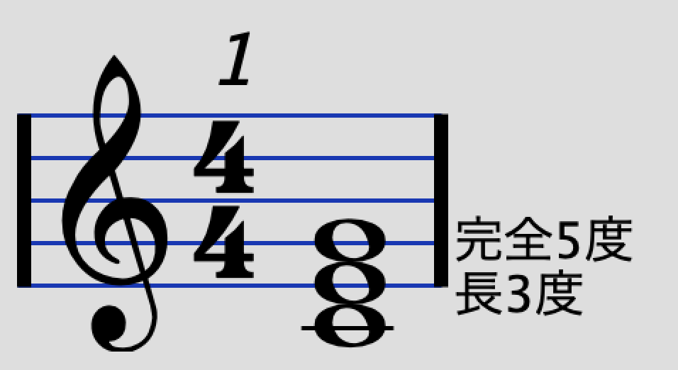

　根音に対して長3度、完全5度からなる和音を**メジャーコード**と言います。

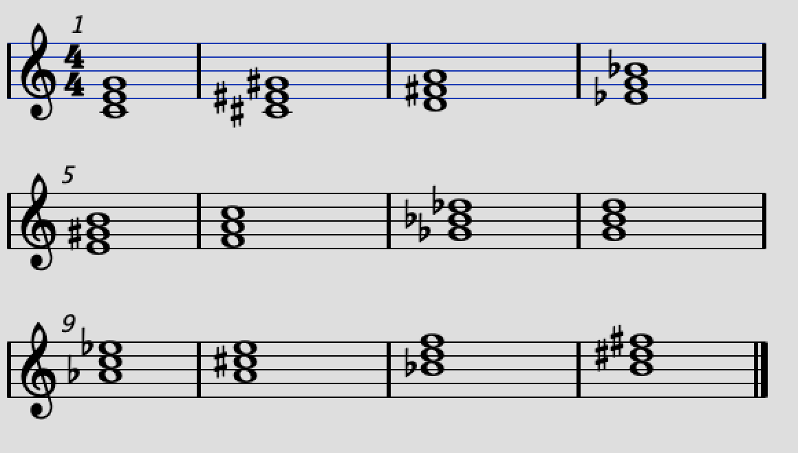

　音は12種類あったので、それぞれを根音としてメジャーコードは12種類あり、それぞれをCメジャー、C#メジャー、Dメジャーなどと言います。注意として、メジャーコードを記号で表す場合、単にC、C#、Dなどと書きます。メジャーコードは単に明るい感じのコードだと思ってもらって差し支えありません。

#### マイナー

　根音に対して短3度、完全5度からなる和音を**マイナーコード**と言います。メジャーコードの3度の音を半音低くするとマイナーになると覚えておけば良いです。

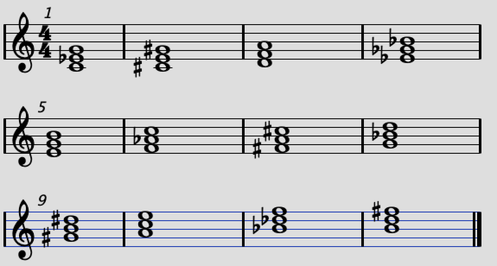

　マイナーコードも12種類あり、それぞれをCマイナー、C#マイナー、Dマイナーなどと言います。記号で表す場合、根音に「m」をつけてCm、C#m、Dmなどと表します。楽譜によっては「m」ではなく「min」と書いてある場合もあります。

　メジャーコードとマイナーコードはコードの理論の中で最も基本的な対象です。これさえあれば**基本的なコード進行はすべて網羅できると言っても過言ではありません**。なので、ピアノでもギターでもいいので、この2種類は覚えて弾けるようになると「**自分は音楽ができる！**」と自信を持っても良いでしょう。ドラムは知らんけど。

### トライアドコード

　実は、コードの中にはメジャーとマイナー以外にも様々なものがあります。3つの音からなるコードのことを**トライアドコード**と言います。メジャーとマイナーもトライアドコードです。では、他にどのようなコードがあるのでしょうか。簡単なコード進行例も織り交ぜて見ていきましょう。

#### sus4 (サスフォー)

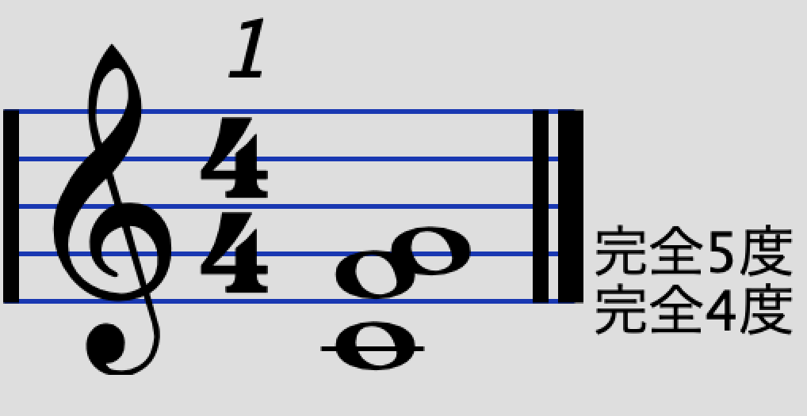

　根音に対して完全4度、完全5度からなるコードを**sus4**と言います。この場合根音がCなのでCsus4となります。フレーズの終わり際に
	
	Csus4 → C

みたいな感じで使うとかっこよく終われたりします。というか専らこの使い方です。

#### sus2 (サスツー)

　根音に対して長2度、完全5度からなるコードを**sus2**と言います。この場合根音がCなのでCsus2となります。sus4と似ていますがsus4と違って使用頻度は極端に少なく、筆者も1回しか使ったことがないです。知識として、こういうコードがあるよってことを知っておくだけで問題ないと思います。

#### aug (オーグメント・オーギュメント)

　根音に対して長3度、短6度からなるコードを**aug**と言います。この場合根音がCなのでCaugとなります。メジャーコードの5度の音を半音高くするとaugになると覚えておけば良いです。
　ちょっと古いですが、「どんなときも(槇原敬之)」のサビ前で、
	
    C	Caug
    
    F			C	
    どんなときも　どんなときも
    Dm	E		Am
    僕が僕らしくあるために
    

という使われ方をしています（元キーはF#）。ほとんどはFやDmの前に挟んで移行を促すという使い方をするのですが、これをサビのド頭に持ってくる変態的な使い方をするコンポーザーもいるので、*これもう分かんねぇな…*

#### dim (ディミニッシュ)

　根音に対して短3度、減5度からなるコードを**dim**と言います。この場合根音がCなのでCdimとなります。メジャーコードの3度と5度の音をそれぞれ半音低くする、あるいはマイナーコードの5度の音を半音低くするとdimになると覚えておけば良いです。
 
　例としては「世界に一つだけの花（SMAP）」のAメロで
 
	C　　F　　　G　　A♭dim
    花屋の店先に並んだ
    
    Am　　F　D　　　G
    色んな花を見ていた
    
 のように使われています。GからAmの間に挟んでマイナーへの移行を促すという使い方をすることが多いです。
 
#### -5 (フラットファイブ)

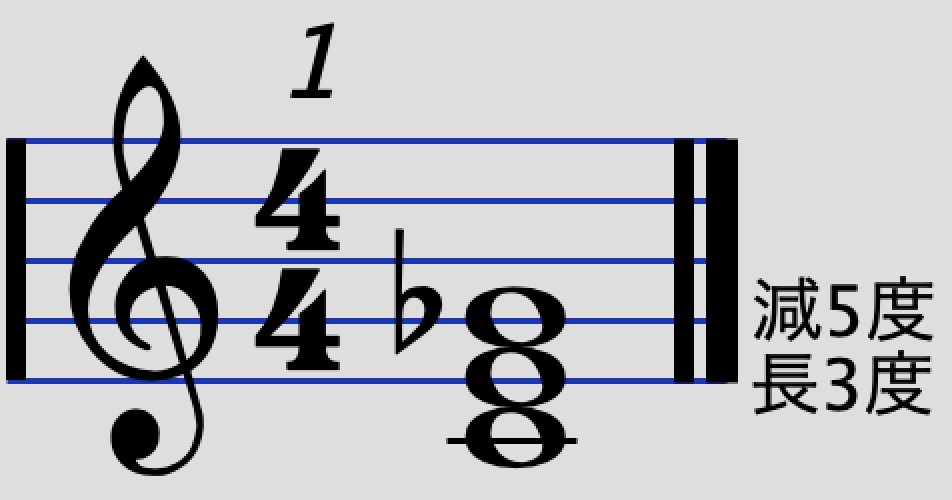

　根音に対して長3度、減5度からなるコードを** -5**と言います。この場合根音がCなのでC-5となります。メジャーコードの5度の音を半音低くすると-5になると覚えておけば良いです。フラットファイブは単体で用いられることよりも、Bm7-5のように複雑な形で用いられることのほうが多いので、例はあとに回します。
 
#### omit (オミット)

　厳密にはトライアドコードではないのですが、構成の方法が似ているので記述しておきます。「omit」とは「省略する」という意味で、そのままの意味でトライアドコードからある度の音を取り除くというのがomitです。例にあるのはC(omit3)で、Cメジャーコードから3度の音を取り除いたものです。このように、3度の音を取り除いたコードを特に**パワーコード**と言い、ギターの5度弾きなどとして使われます。
 
### テトラッドコード

　トライアドコードは3つの音からなるコードでしたが、1つ音を足して4つの音からなるコードのことを**テトラッドコード**と言います。トライアドコードだけでは単調になりがちなコード進行も、テトラッドコードを加えることで簡単におしゃれになります。ここから少し複雑になっていきます。がんばって覚えましょう。

#### 7 (セブンス)

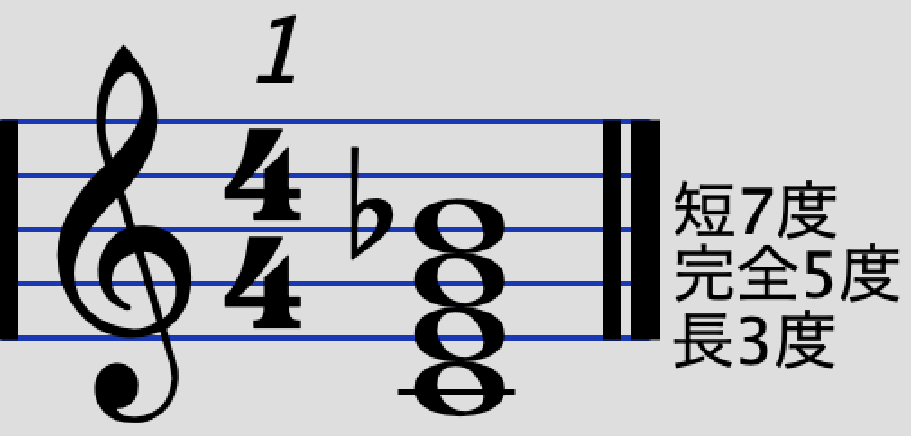

　根音に対して長3度、完全5度、短7度からなるコードを**7**と言います。この場合根音がCなのでC7となります。メジャーコードに7度の音を**半音低くして**付け足すとセブンスコードになります。
 
#### m7 (マイナーセブンス)

　根音に対して短3度、完全5度、短7度からなるコードを**m7**と言います。この場合根音がCなのでCm7となります。マイナーコードに7度の音を**半音低くして**付け足すとマイナーセブンスコードになります。
 
#### △7 (メジャーセブンス)

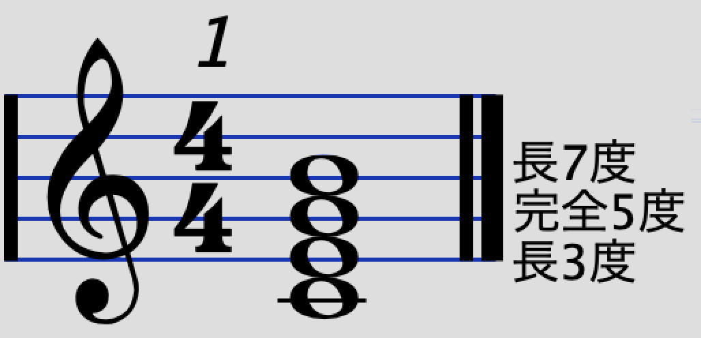

　根音に対して長3度、完全5度、長7度からなるコードを**△7**と言います。この場合根音がCなのでC△7となります。メジャーコードに7度の音を付け足すとメジャーセブンスコードになります。セブンスコードとごっちゃに成りやすいので注意しましょう。あと、このサークルの名前にも入っているのでぜひ覚えてドヤ顔で使えるようになりましょう！  
　メジャーセブンスを表す記号は楽譜によって異なり、「CM7」「CMaj7」などと表すこともあります。
 
 #### m△7(マイナーメジャーセブンス)

　根音に対して短3度、完全5度、長7度からなるコードを**m△7**と言います。この場合根音がCなのでCm△7となります。マイナーコードに7度の音を付け足すとマイナーメジャーセブンスコードになります。マイナーなのかメジャーなのかよくわからない名前です。
　メジャーセブンスと同様にマイナーメジャーセブンスを表す記号も楽譜によって異なり、「CmM7」「CmMaj7」などと表すこともあります。
 
#### dim7 (ディミニッシュセブンス)

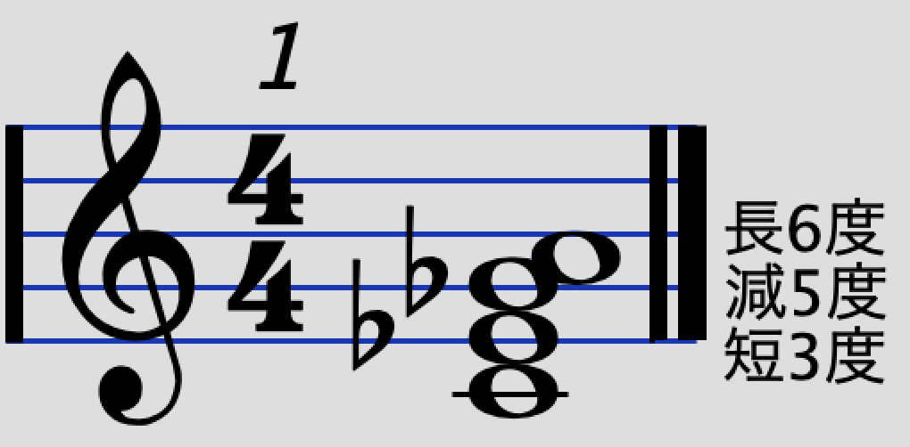

　根音に対して短3度、減5度、**長6度**からなるコードを**dim7**と言います。この場合根音がCなのでCdim7となります。マイナーコードに**6度**の音を付け足すとディミニッシュセブンスコードになります。名前に「セブンス」と入っているけど、**付け足す音は6度の音なので注意しましょう。**
 
#### m7-5 (マイナーセブンスフラットファイブ)

　根音に対して短3度、減5度、短7度からなるコードを**m7-5**と言います。この場合根音がCなのでCm7-5となります。フラットファイブに7度の音を**半音低くして**付け足す、あるいは普通のマイナーセブンスの5度の音を半音低くするとマイナーセブンスフラットファイブになります。
 
#### 6/m6 (シックスス/マイナーシックスス)

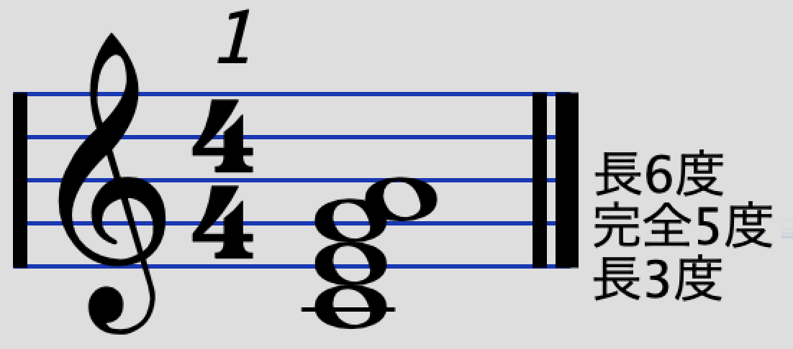

　根音に対して長3度、完全5度、長6度からなるコードを**6**と、短3度、完全5度、長6度からなるコードを**m6**とそれぞれ言います。この場合根音がCなのでC6およびCm6となります。メジャーおよびマイナーコードに6度の音を付け足したものがシックススコードです。

***

　以上までが基本的かつ重要な内容でした。以下の内容は発展的な要素を含むので、読み飛ばして4章に進んで頂いても全く問題ありません。
 
***

### 分数コード

#### ベース音
　ここで、コードにおける**ベース音**という概念を紹介したいと思います。  
　まず、第1章でも述べましたが、音というのは空気の波のことでした。音の大きさは波の振幅、音の高さは周波数に対応していました。では音色、つまり「何から発せられた音か？」という情報は**波形**によって定まります。ここで、「**周期的な関数は三角関数の（無限）和で表すことが出来る**」という定理が成り立ちます。音の波も周期的な関数であるので、異なる振幅、周波数の三角関数をたくさん持ってきて、それらを足し合わせる（同時に鳴らす）ことによって元の音を作ることが出来ます。  
　ここで、三角関数たるサイン波について説明します。
 
 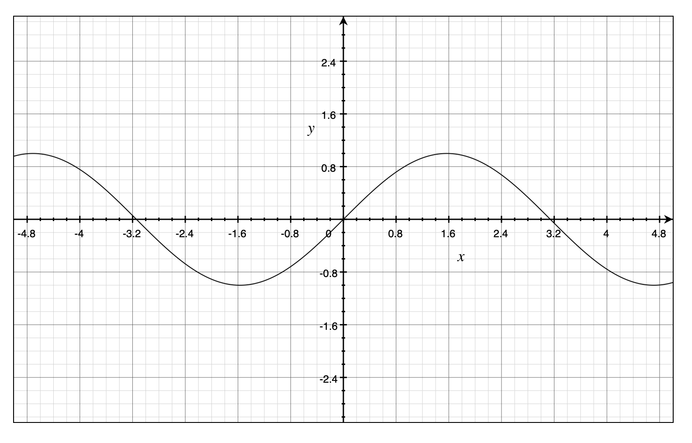
 
　サイン波は単一の振幅、周波数をもつ周期関数であり、とても機械的で平坦な音をしています。一方で、前述の通り、任意の音は三角関数の和で表されるので、種類の異なるサイン波を沢山用意して同時に鳴らせばピアノの音やバイオリンの音を、ひいては楽曲でさえ再現することが（理論上は）可能です。
 
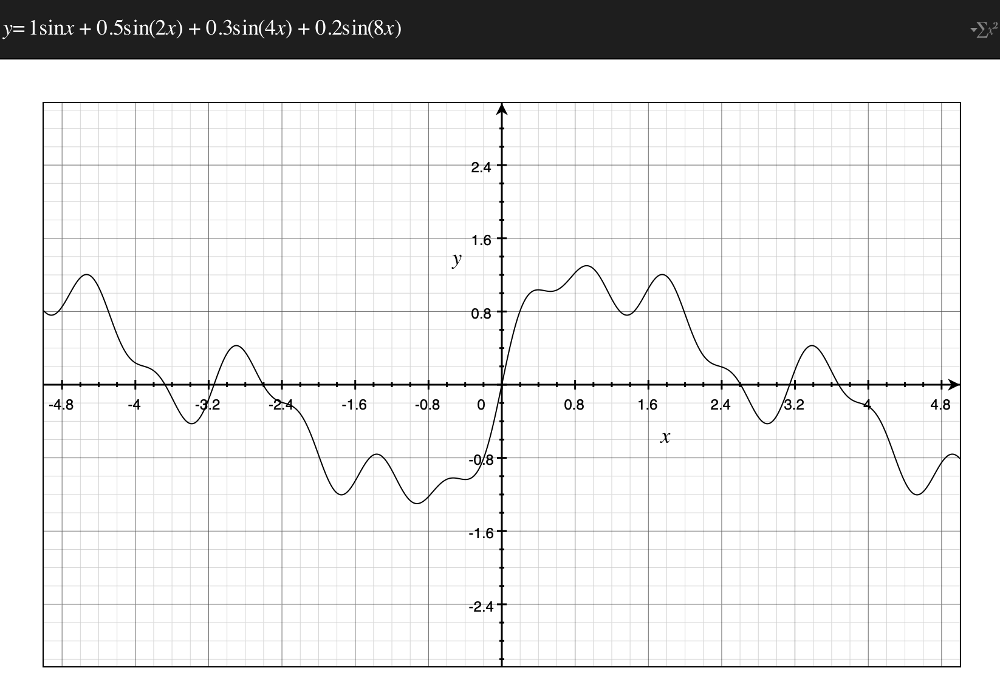 
 
　つまり、第1章で「A3」が220Hzと言いましたが、楽器（例えばピアノ）によってはこの220Hzのサイン波の他にも沢山の周波数の異なるサイン波が組み合わさっているということです。大事なことは、それらのサイン波の和の中には**220Hzより低い音、つまり周波数が小さいサイン波は含まれない**ということです。このようなサイン波の音を**基音**と言います。基音以外の音を上音、あるいは基音の何倍かの周波数を持つ音という意味で**倍音**と言ったりします。上述の通り、サイン波は倍音を全く持たない基音のみの音になります。   
　普通ピアノやギターあるいはベースにおいて、曲の中で最も低い音（=ベース音）を演奏した場合、それらの楽器の音はサイン波ではないので、いくらかの倍音が含まれているわけです。それらの音はより高い音と干渉しあい独特なハーモニーを生みますが、ベース音の基音自体は何の音とも干渉しません。つまり、**ベース音は曲のある一点において、音楽の現在の性質を決定付けている音だ**と言うことが出来ます。このような理由から、楽曲の局所的な音楽性を左右するベース音を考えることはとても重要であることが分かって頂けたかと思います。  

#### 分数コード/onコード

　余談がすぎた。（司馬遼太郎リスペクト）
　では実際にはどのようにベース音が大事になってくるのかを見ていきます。
 

### テンション

　ダイアトニックスケールにおいては1度から8度までの音程があることを勉強しましたが、実はそれ以上に9度、10度…とそれ以上の音程も同様に定義されています。それらのうち、「9、11、13」度の音程を特に**テンションノート**と言います。また、テトラッドコードにこれらのテンションノートを付け加えたコードを**テンションコード**と言います。実際にはもっと上のテンションもありますが、ここでは割愛します。
 
*執筆中 (2019/7/5)*

***

　スケールにおけるコードの役割というのはとても深く難解な理論を含んでいるのですが、ここでは実際に曲を作るために最低限知っておくべき知識だけにとどめたいと思い、そこらへんは割愛します。次の章では実際にこれらのコードを組み合わせてコード進行を構成していきたいと思います。