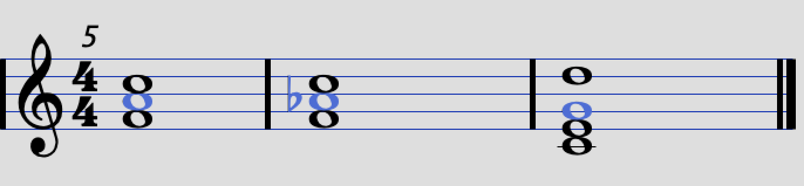
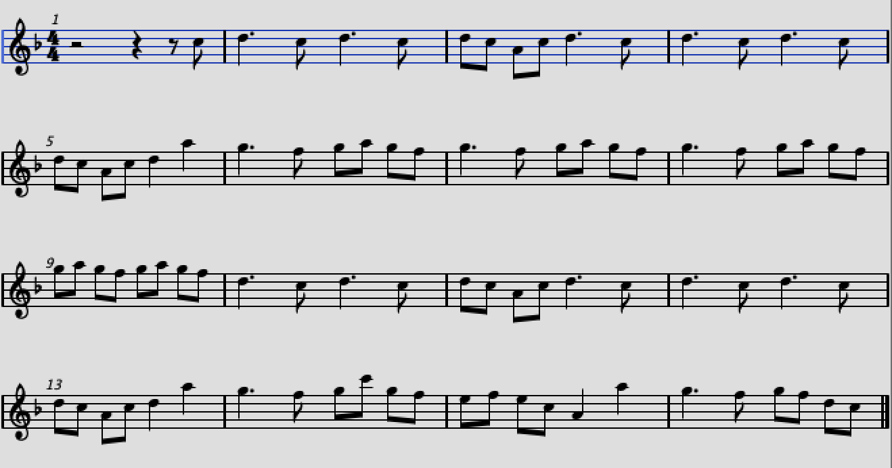
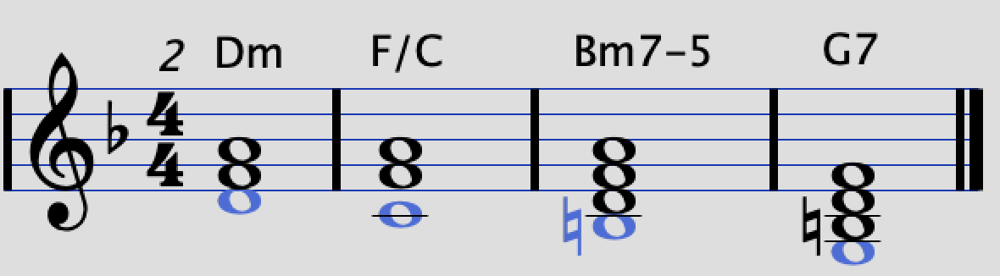
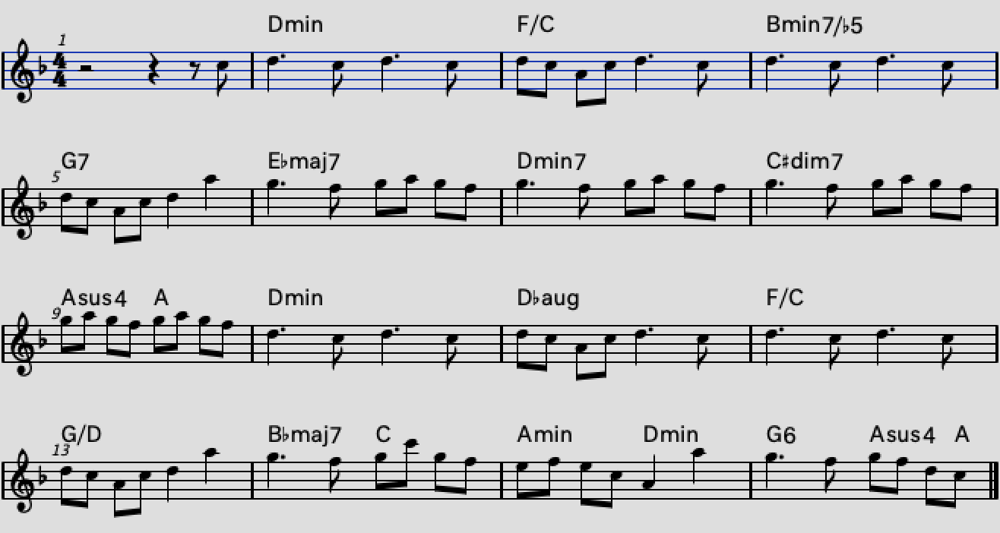

# コード入門 4
YNUCL COMICAL COMIC△7

## 応用
　前章まででコードおよびコード進行に関する理論的な部分を学習しました。では、演奏したり曲作りをしたりする上でどのような思考が必要になるのかを実際の筆者の曲作りを参考にして考えていきます。
 
### 実用性の高いコード進行
　この節では実在の楽曲で頻出するコード進行および筆者が曲作りに置いて実際に使用した経験のあるコード進行を紹介します。

#### 1625

	I | VI7 | IIm | V7
    
　循環コードの一種で、主にメロディで使われます。転調気味の降下からのツーファイブという、とても軽快で爽やかなサウンドです。  
　一口に1625と言っても沢山のバリエーションがあります。VI7をVImにする大人しめになったり、IImをIIm7にして少しシックな雰囲気にしたり…などです。

#### 3625

	IIIm | VIm | VIIm | V7
    
　循環コードの一種で、Bメロ専用コードと言っても過言ではないほどBメロによく使われています。IIIm自体が代理トニックなので循環させたときにドミナントモーションになると思えば、最後のV7はVでも大丈夫です。

#### 降下

	VIm | V | IV | IIIm
    
　循環コードの一種で、どこにでも使える便利なコードです。根音が1度ずつ降りて来るので降下進行と言います。最後のIIImはIIIやIII7にしても大丈夫ですが、ドミナントモーションが発生することにより VIm へ向かう力が強くなります。

#### 上昇

	IIm7 | IIIm7 | IV | V
    
　これは循環コードではないですが、全く繰り返せないわけでもないです。ケースバイケース。根音が1度ずつ上がってくるので上昇進行と言います。上昇のあとはトニックに帰結してもいいし、VIIに偽終止しても面白いと思います。

#### クリシェ

	VIm V♯aug | I/V IV♯m7-5
    
　和音をほとんどの部分を固定して一つだけの音を動かしていく進行を**クリシェ**と言います。上記の例はベース音が動いているのでベースクリシェと言います。この例に続けてツーファイブするとかっこいいですよ。

#### 偽クリシェ

	I | Idim7(omit3) | IVm/I | I△7
    
　コードの大部分を固定して一音動かすのがクリシェですが、これと似たような感じで**一音を固定して他を動かす**ということもできます。割とオシャレ感が出ていいですが、**静かめのAメロ**とかにしか使いどころさんはないんじゃないですかね？
 
#### 445系

	IV | IVm | Vsus4 | V
    
    IV | IV♯dim | Vsus4 | V
    
　サビの直前、Bメロの最後とかにいかに盛り上がりを持ってくるか、というのが難しかったりします。  
　1つ目のやつは3度の音を半音下げるのですが、そうするとドミナントの裏コードの構成音になるのでVに向かいやすくなります。  
　2つ目のやつは簡単に言うとツーファイブです。IV#dimというのはII7のomit1だと思えばツーファイブであることが分かると思います。露骨なツーファイブ感を出さずにドミナントモーションぽく自然に推移できるのがメリットです。あと、sus4からのVとかはどうでもいいです。

### 王道進行のバリエーション

　筆者は王道進行マニアで、王道進行の楽曲だけを集めたプレイリストを常日頃から鑑賞しているだけでなく作曲においても王道進行をメロディ・サビの区別なく多用しています。とは言っても流石にずっとおんなじことばかりしててもつまらないので、**微妙な変化**を加えながらバリエーションを楽しんでいます。そのような微妙な差異をいくつか紹介したいと思います。
 
#### 基本形

	IV | V | IIIm | VIm
    
    IV | V | I | Vm I7
    
　王道進行の最もオーソドックスな形です。2フレーズ目は3小節目でトニックに一度帰結し、次の小節でセブンスを入れます。この進行を繰り返した場合 I7 の次は IV になるので、セカンダリードミナントからのドミナントモーションになっているのですが、セブンスの前で Vm を挟むと少しおしゃれになります。

#### かっこよさ強め

	IV△7 | V | IIIm7 | VIm7
    IV△7 | V | VIm7 | VII♭ I7
    
　最初の IV を IV△7 にするだけで一気に格好良くなります。ポップよりは**ロック調**で、ぱっと聞き少し**暗さを感じる**（VImの構成音が含まれるから）のがアクセントになっています。「God knows... / 涼宮ハルヒ（平野綾）」などでも同様の進行が使われています。サビの先頭で使うとかっこいいです。
 
#### つなぎ目

	IV V | III VIm
    IV II7 | Vsus4 V
    
　この変化型はサビの頭とかでは使いづらいと思います。サビの前半にカノンコード使って、もう一度サビの聞かせどころさんに向かう前のつなぎ目として使ったり出来ると思います。
 
#### 一時停止

	IV | V | VIm | I
    IV | V | VIm
    
　3小節目で代理トニックに一度帰結してしまうのも良いんじゃないですか？僕はあんまり良さがわからないのであまり使わないのですが、J-POPでは結構聞きますね。

#### ベース音を固定

	IV | V7sus4/IV | III7sus4 III7 | VIm7 Vm7/I
    
　1小節から2小節にかけてベース音を固定してみるのも趣があります。進行が動いた感がぼやけるので、伴奏が白玉（全音符を使い、それほどメロディックでないもの）のときにいい感じになります。

#### オシャレ終止

	IV | V | IIIm | VI
    IV | IVm | Iadd9
    
　4小節目が VI になっていることが重要です。VI はダイアトニックコードでないので異質の響きになっていることがぱっと聞きで分かるので、明らかに「*変な終わり方しそう*」と思わせることが出来ます。あとは変な終わり方をするだけですが、最後のドミナントモーションでトニックに帰結するのではなく、**サブドミナントからトニックへの弱めの帰結**をします。しかし、ただ帰結するのではなく間にIVmを挟むことによって、
 

青色の音符の部分が半音進行しており、クリシェ気味にトニックへ移行しているのが分かるかと思います。この進行はフレーズの中で何度も使ったり循環させたりは出来ません。**終始したら次のフレーズに行きましょう。**

#### 全降下終止

	IV△7 | IVdim7 | IIIm7 | IV♯m7-5/III
    IIm7 | II♭7 | I△7
    
　これ王道進行か…？と思う人がいるかも知れませんが、一応王道進行の範疇に入るかと考えています。というかIVから始まるコード進行は全部王道進行だろ。（暴論）  
　2小節ごとにベース音が半音降下し、5小節からは1小節ごとにベース音が半音降下しています。つまり1から2小節および3から4にかけては偽クリシェとなっています。4小節目の **IV#m7-5/III**の代わりに**IV#dim7**や**II7-5**を使っても良いです。お好みで。  
　6小節目の II♭7 はドミナントの裏コードで、I△7 へ帰結させて少し余韻を残す感じにしています。

### コード進行を作る
#### 理論を忘れること
　ここまで書いておいてあれですが、作曲においては**理論を忘れてしまうことも大事です**。ただ、そのためにはどこからどこまでを理論として保持しておくか、どこまでを忘れるか、といった知識と技能のレンジを決めておく必要があり、その経験を積むためにもやはり理論を学ぶことに意味があるわけです。  
　日本の楽曲のほとんどは三大進行およびそれらのバリエーションで構成されています。逆にいえば、**それらに全く縛られない進行を使えばそれだけでオリジナリティが出ます**。これから記述する内容は、コードを扱うことが出来る楽器（キーボードやギター）が最低限扱えることを前提に書いていきます。
 
#### 鍵盤、指板をさわる

　こんなこと当たり前ですが、頭の中で理論をぐるぐる回してるだけでは全く意味がありません。**自分で楽器をさわって経験的に理解してください。**
 
#### メロディから？コードから？

　曲はメロディと伴奏で成り立っています。歌のある曲ならそれに詞が含まれるわけですが、このテキストには関係ないので割愛します。じゃあ、メロディと伴奏はどちらから先に作るのか？ということですが、実際のところさん**どっちもあります**。完全に個人の趣味です、自分の思いついた方からやりましょう。  
　基本的にはメロディーに対してコードがユニークに定まるわけではないので、**まずメロディを作ってからコードを当てていくのが良い**とは思います。  
　逆に、「**こういうコードを使いたい**」という意志があれば、コード進行だけ先に作っておいてから、それに合うメロディを無理やり付けていくことも出来ます。でも、結構難しいです。制約が多いので。
 
#### 実践例

　ここでは、2019清陵本で発表した楽曲「いとえちなり」のサビのコード進行の制作過程を示します。  
　この曲は漫研民の声を音ネタとして使っている曲で、「えっちなものを見たときに『えっちだなぁ』と感じたその感情を歌に込めて作った」曲です。コードを少しだけ凝ったので、題材として取り上げたいと思います。
 

　画像はこの曲のサビのメロディです。メロディを先に作り、ここにコードをつけようということになりました。  
　まず、この曲はFメジャースケール（Dナチュラルマイナースケール）、つまりヘ長調（ニ短調）で、常にシにフラットが付く音階です。  
　**大抵のメロディは王道進行に当てはめれる**ので、パパっとやって…終わり！（適当）と思っていたのですが、この曲に関しては全然うまく行きませんでした。仕方ないので、ちょっと伴奏を考えなくてはならない状況になってしまいました。  
　さて、皆さんはどのようなコードを付けますか？基本的に**コード付けに正解はない**ので、自分の好みのコードで良いと思います。フィーリングでやってみましょう。  

##### 2〜5小節

	VIm | I/V | IV♯m7-5 | II7

　まず、サビのド頭なので、さすがにトニックを使いたいなと**僕は**思ったので、短調の代理トニックのVImを置きます。トニックの次は一度ドミナントを挟んでから別のトニックに行ってドミナントモーションするというのがよくあるパターン（カノン進行など）なのですが、ただやるのも面白くないので、僕は **I/V** へ行きました。これはドミナントに行っているわけではないのですが、ベース音をVにすることで少しだけドミナントの成分を出しているわけです。  
　さて、ここまででベースが1度下がったわけですから、このままベースだけ動かして**クリシェ**にしちゃえばいいや！ということになりました。**試しに半音下げてみる**といい感じになったので採用しました。これが IV♯m7-5 です。このように、**ガチャガチャチンパンジームーブ**が実を結ぶことが曲作りではままあるので、自分で楽器を弾いてみることは大事ですよ！  
　ぱっと聞き分かるのですが、もう3つめのコードで「なんか変な事やっとんな」感が出ちゃってるので、4つめのコードは**大きく変化させない**でその違和感を引張ると良かったりします。もちろん良くないパターンもあります。ケースバイケースです。
 

　このように、青色の音符が少しずつ動いているのが分かると思います。ピアノで弾くとあんまり動かないので簡単なのですが、ギターとかベースを録音するときに結構むずくて頭にきました。はーつっかえ！やめたら作曲ゥ…
 
##### 6〜9小節

	VII♭△7 | VIm7 | V♯dim7 | IIIsus4 III

　4〜5にかけて力をためたので、ここで一段落したりしないでギアを上げていきます。曲作りは**大体4小節を1ブロック**だと思うことが多いので、この4小節の頭も割と大事にしたほうが良いです。
　その頭に **VII♭△7** なわけですが、どうしてこうしたか*あんまり覚えてません。*無理やり説明すると、ちょうど VII♭7 は III7 の裏コードになっています。もともと
 
	III | VIm
    
という36のドミナントモーションがあって、その中のIIIを裏に変えて

	VII♭7 | VIm7 
    
にして、さらに7を△7に変えて

	VII♭△7 | VIm7 

というふうにしたんだと思います。  
　また、6から8小節にかけてベース音が半音ずつ下がっているので、これは降下の一種と言えます。8小節目が V#dim7 になっているのは、9小節目つまりブロックの最後を III で終わりたいという意志が先に出ていて、似た構成音をもつこのコードにしました。
　9小節目は IIIsus4 からの III となっていますが、ここに特に7が付いていないのは、10小節目に VIm に行こうと思っているからです。ドミナントモーションをする上で、Iに戻るときは V でも V7 でも良いと思いますが、**VIm に戻るときは III7 より III のほうが良いかなと思います。特に短調のときは。**

##### 10〜13小節

	VIm | V♯aug | I/V | II/VI
    
　サビの2サイクル目です。1サイクル目は全音、半音の順に下がるクリシェにしたので、2サイクル目は**半音ずつ下がってみよう**という変化を付けてみました。一般的には**1サイクル目と2サイクル目は大きく変化させないのがセオリー**ですが、制作当時いわゆる*イキスギコード*に傾倒してて、「なにか変なことやらなきゃ！」という思いが強かったんだと思います。  
　さて、再びトニックに戻りました。直前が III だったのでドミナントモーションでナチュラルに戻ってきたわけです。  
　「半音ずつ下がるクリシェ」と決めたので、コードは自然とV♯aug からの I/V になると思います。ですが、降下から一転して13小節目で上がってみました。ここは全部とっかえひっかえしてるのでクリシェではありません。ずっとクリシェしてたので単調になってしまうのを避けたんだと思います。
 
##### 14〜16小節

	IV△7 V | IIIm VIm | II6 IIIsus4 III
    
　**出ました王道進行**。僕は曲の何処かに王道進行を入れないと死ぬ呪いにかかっているので、最後の最後にねじ込んでやりました。基本形でオーソドックスに王道進行させて一旦落ち着かせます。  
　17小節からは VIm 気味のN.C.ブロックにすることを予め決めておいたので、もちろんIIIでブロックを終わりたいわけです。ですが、その前にII6を挟むことによって変化をつけてみました。II6とIIIは構成音が結構似ているので、違和感なく移行できます。

##### 完成形

　最終的にはこんな感じになりました。**安易によくあるパターンを使わない**ということも曲を作る上では大事です。でも、そのためにもよくあるパターンを知っておくことは重要です。また、よくあるパターンを使うことのメリットは**ぱっと聞き心地いい音楽になる**ことです。そりゃ聞き慣れてるんだからいい曲になるよってことです。「**いい曲だけどよくある感じの曲か、不自然で珍しい曲を志向するか**」を自分でよく考えて作ると良いでしょう。

### リンク

1. [基礎知識](chord_1.md)
1. [コード](chord_2.md)  
1. [コード進行](chord_3.md)  
1. 応用(今ここ)